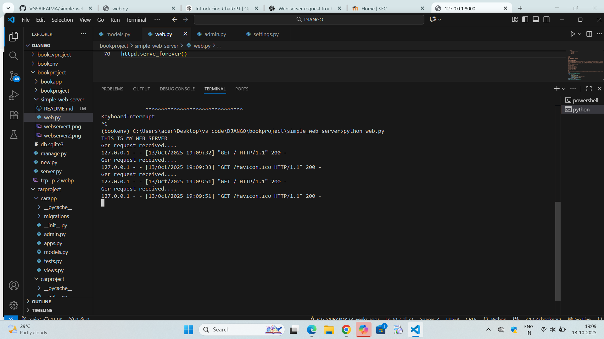

# EX01 Developing a Simple Webserver

# Date: 19.09.2025
# AIM:
To develop a simple webserver to serve html pages and display the configuration details of laptop.

# DESIGN STEPS:
## Step 1:
HTML content creation.

## Step 2:
Design of webserver workflow.

## Step 3:
Implementation using Python code.

## Step 4:
Serving the HTML pages.

## Step 5:
Testing the webserver.

# PROGRAM:from http.server import HTTPServer,BaseHTTPRequestHandler
content =

```
<!DOCTYPE html>
<html>
<head>
<style>
    div{
        
        background-color:lavender;
        border:5px solid black;
        padding:10px;
        }
    .suite{
        display:flex;
        flex-wrap:wrap;
        background-color:black;
        margin:10px;
        padding:10px;
        width:70%;

        
    }
    .lists{
        background-color:beige;
        color:black;
        margin:30px;
        padding:15px;
        width:50px;

    }

</style>
</head>
<body>
<div>
<h1> TCP/IP PROTOCOL LAYERS</h1>
<ol>
<li> 
<h3>APPLICATION LAYER</h3>
<p>The Application Layer is the top layer of the TCP/IP model and the one closest to the user. This is where all the apps you use like web browsers, email clients, or file sharing tools connect to the network. It acts like a bridge between your software (like Chrome, Gmail, or WhatsApp) and the lower layers of the network that actually send and receive data.</p></li>
<li><h3>TRANSPORTATION LAYER</h3><p>The Transport Layer is responsible for making sure that data is sent reliably and in the correct order between devices. It checks that the data you send like a message, file, or video arrives safely and completely. This layer uses two main protocols: TCP and UDP.</p></li>
<li><h3>NETWORK LAYER</h3></p>The Internet Layer is used for finding the best path for data to travel across different networks so it can reach the right destination. It works like a traffic controller, helping data packets move from one network to another until they reach the correct device. This layer uses the Internet Protocol (IP) to give every device a unique IP address, which helps identify where data should go.</p></li>
<li><h3>DATA LINK LAYER LAYER</h3><p>The Network Access Layer is the bottom layer of the TCP/IP model. It deals with the actual physical connection between devices on the same local network like computers connected by cables or communicating through Wi-Fi. This layer makes sure that data can travel over the hardware, such as wires, switches, or wireless signals.</p></li>
</ol>
<h2>TCP/IP PROTOCOL SUITES</h2>

<ul class="suite">
<li class="lists">HTTP</li>
<li class="lists">FTP</li>
<li class="lists">SMTP</li>
<li class="lists">TELNET</li>
<li class="lists">TCP</li>
<li class="lists">UDP</li>
<li class="lists">DNS</li></ul>
<br>
<a href="https://www.tutorialspoint.com/data_communication_computer_network/tcp_ip_model.htm">FOR MORE REFERENCE CLICK THE BELOW LINK</a>
</div>
</body>
</html>
class MyServer(BaseHTTPRequestHandler):
    def do_GET(self):
        print("Ger request received....")
        self.send_response(200)
        self.send_header("content-type","text/html")
        self.end_headers()
        self.wfile.write(content.encode())
print("THIS IS MY WEB SERVER")
server_address=('',8000)
httpd=HTTPServer(server_address,MyServer)
httpd.serve_forever()

```
# OUTPUT:




# RESULT:
The program for implementing simple webserver is executed successfully.
